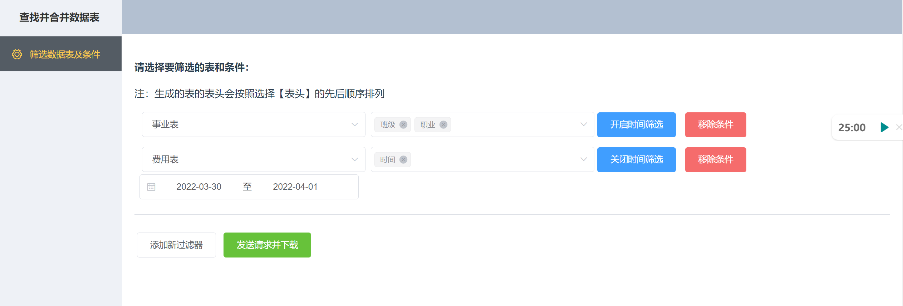
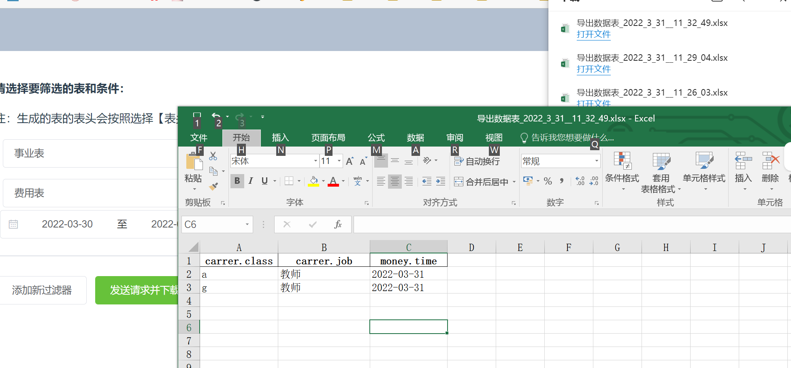
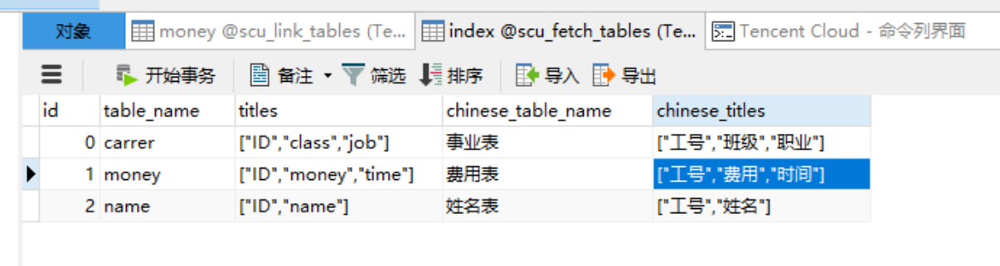
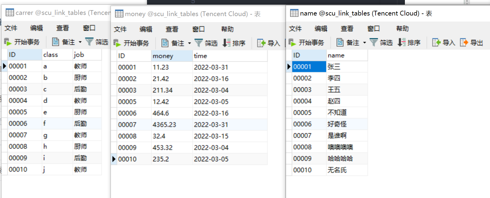

# 数据库多表查询合并为Excel并下载
本仓库是基于VUE前端和Flask后端构建的轻量级应用。

主要功能是从大量数据表中，构建一个图形化界面帮助我们从具有相同主键的表中筛选需要的字段，简要根据时间进行筛选，合成一个完整的数据表以后，通过网络请求下载对应的Excel文件即可。

前后端完备。

## 基本界面：

通过添加查询行来添加约束，当确认好所有的信息之后，就可以点击发送请求下载筛选后的数据表。

> 需要注意，目前必须确保每一行的所有信息都已经被填写，暂时没有添加约束条件，需要注意这个问题。

## 数据表
本项目分为两个数据库进行连接：
- 第一个是用来保存所有表的信息的数据库，里面原则上只有一张表，存储了各个表的表头字段和对应的中文字段信息。字段以`json`字符串格式存储在一个数据项里。

  
- 第二个是所有待查询数据的存储数据库，非常好理解：
  

在初始化过程中，难点其实偏向于如何构建所有表的索引数据表，需要使用一些自动化脚本来组合为对应格式。
## 状态
- 第一版开发完成。
  